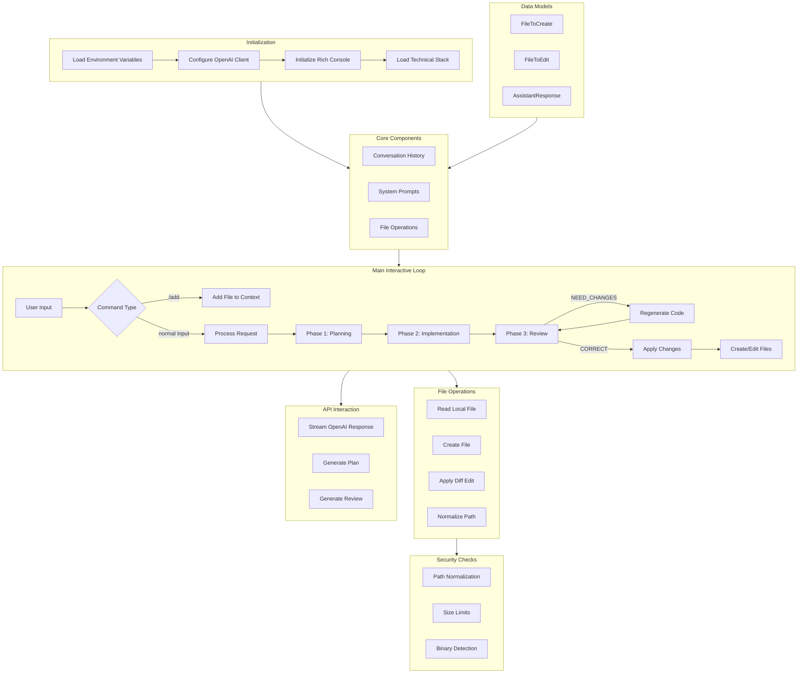

# Infrared Code Generation System Documentation

## System Overview

This system is a CLI-based code generation and management tool that interfaces with the DeepSeek API. It employs a three-phase approach to code generation: Planning, Implementation, and Review. The system uses Rich for console UI rendering and prompt_toolkit for enhanced input handling, while implementing robust file operations with comprehensive security checks. it has a feature that allows the planning phase to be turned off. this is permitted.

## Architecture Diagram



## Core Components

### Data Models (Pydantic)
- **FileToCreate**: Schema for new file creation
  - `path`: File path
  - `content`: File content
- **FileToEdit**: Schema for file modifications
  - `path`: File path
  - `original_snippet`: Code to be replaced
  - `new_snippet`: Replacement code
- **AssistantResponse**: API response structure
  - `assistant_reply`: Main response text
  - `files_to_create`: List of FileToCreate objects
  - `files_to_edit`: List of FileToEdit objects
  - `analysis`: Review analysis (optional)
  - `explanation`: Review explanation (optional)
  - `output`: Status code (optional)

### System Prompts
1. **Planning Prompt**: Guides implementation strategy creation
2. **Review Prompt**: Defines code review criteria and validation
3. **System Prompt**: Main prompt for code generation logic

### Conversation Management
- Maintains conversation history with system and user messages
- Handles file content as system messages
- Implements context management for multiple files
- Provides conversation trimming to prevent token limits

## Workflow Phases

### 1. Planning Phase
- Takes user input and generates implementation strategy
- Creates detailed step-by-step plan
- Considers:
  - Security implications
  - Performance impacts
  - Testing requirements
  - Edge cases
  - Error conditions

### 2. Implementation Phase
- Generates code changes based on the plan
- Capabilities:
  - Create new files
  - Modify existing files
  - Handle file operations with security checks
  - Manage dependencies
  - Validate changes

### 3. Review Phase
- Validates generated code against criteria
- Features:
  - Up to 3 regeneration attempts
  - Detailed feedback on issues
  - Validation pipeline
  - Quality checks

## Security Features

1. **Path Security**
   - Normalization to prevent directory traversal
   - Validation of file paths
   - Security checks for operations

2. **File Limitations**
   - 5MB size limit
   - Binary file detection
   - Extension filtering

3. **Environment Security**
   - Safe handling of variables
   - API key protection
   - Secure file operations

## Technical Details

### File Operations
```python
def read_local_file(file_path: str) -> str:
    """Return the text content of a local file."""
    with open(file_path, "r", encoding="utf-8") as f:
        return f.read()

def create_file(path: str, content: str):
    """Create (or overwrite) a file with security checks."""
    file_path = Path(path)
    if any(part.startswith('~') for part in file_path.parts):
        raise ValueError("Home directory references not allowed")
    if len(content) > 5_000_000:  # 5MB limit
        raise ValueError("File content exceeds 5MB size limit")
    file_path.parent.mkdir(parents=True, exist_ok=True)
    with open(file_path, "w", encoding="utf-8") as f:
        f.write(content)

def apply_diff_edit(path: str, original_snippet: str, new_snippet: str):
    """Apply precise code modifications with validation."""
    content = read_local_file(path)
    occurrences = content.count(original_snippet)
    if occurrences == 0:
        raise ValueError("Original snippet not found")
    if occurrences > 1:
        raise ValueError(f"Ambiguous edit: {occurrences} matches")
    updated_content = content.replace(original_snippet, new_snippet, 1)
    create_file(path, updated_content)
```

## Command Reference

1. File Management
   - `/add path/to/file`: Add single file to context
   - `/add path/to/folder`: Add entire directory to context

2. Session Control
   - `exit`: End session
   - `quit`: End session

## Error Handling

1. **API Errors**
   - Connection failures
   - Response parsing
   - Token limits
   - Timeout handling

2. **File Operation Errors**
   - Permission issues
   - Path validation
   - Size limitations
   - Format validation

3. **Recovery Mechanisms**
   - Graceful degradation
   - User feedback
   - State preservation
   - Context recovery

## Complete Source Code

```python
#!/usr/bin/env python3

import os
import sys
import json
from pathlib import Path
from textwrap import dedent
from typing import List, Dict, Any, Optional
from openai import OpenAI
from pydantic import BaseModel, Field
from dotenv import load_dotenv
from rich.console import Console
from rich.table import Table
from rich.panel import Panel
from rich.style import Style
from prompt_toolkit import PromptSession
from prompt_toolkit.styles import Style as PromptStyle

[Rest of the source code...]
```

### Key Implementation Notes

1. The system uses a three-phase approach to ensure code quality:
   - Planning phase for strategy
   - Implementation phase for code generation
   - Review phase for validation

2. File operations are wrapped with security checks to prevent:
   - Directory traversal
   - Unauthorized access
   - Resource exhaustion
   - Data corruption

3. The conversation management system:
   - Maintains context
   - Handles file content
   - Manages token limits
   - Preserves system state

4. Error handling is comprehensive and includes:
   - Input validation
   - API error handling
   - File operation safety
   - Recovery mechanisms

This documentation provides a complete overview of the system's architecture, components, and implementation details. For specific implementation questions or updates, refer to the source code and comments within each module.